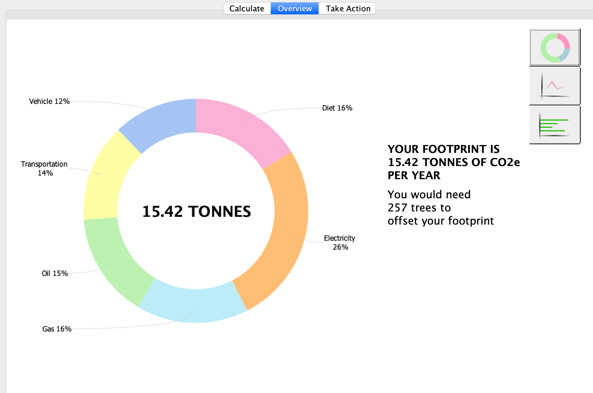
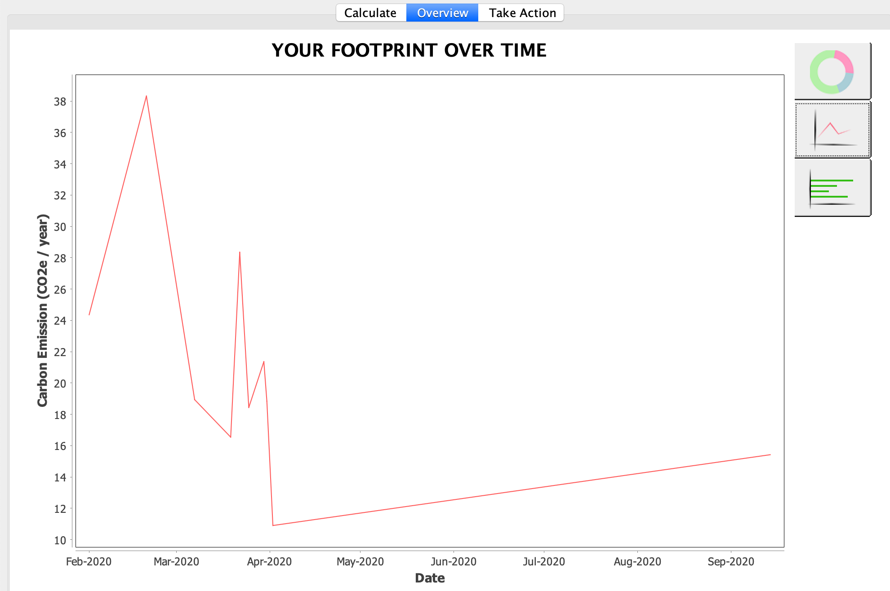
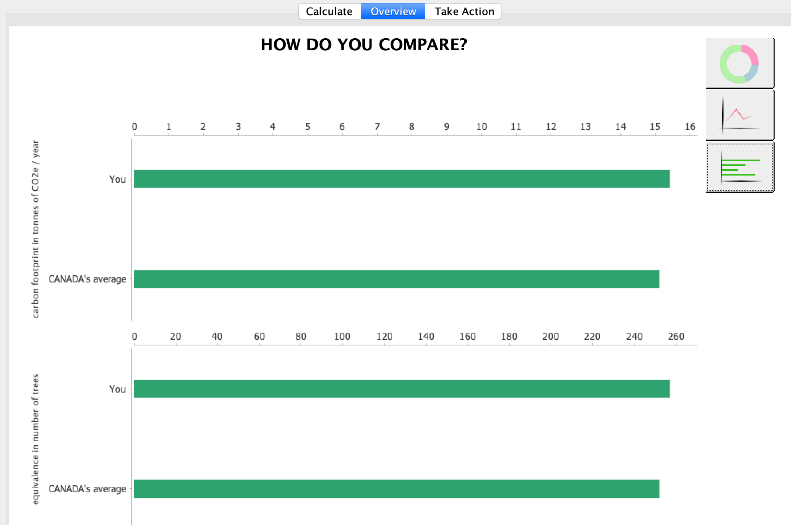

# Carbon Footprint Tracker

### UBC CPSC 210

**Track your impact on the climate with a carbon footprint calculator. Monitor how each part
of your daily life is contributing to climate change from your daily lifestyle choices.** 
 
 This application is aimed to be used by the average person to provide insight into their impact on the climate.
 The application aims to promote awareness and guidance towards a sustainable future. 
 I started this project to educate myself on urgent climate matters and enlighten others towards the relevancy of sustainability.
 
 Developed using Java Swing.
  
 
## Features
- Calculate your yearly carbon footprint based on your daily activities
- Compare your carbon footprint to the average person in your country
- Receive a personalized chart of where your carbon emissions are coming from
- Receive tips on where to lessen your carbon emissions

## How to Use
- In the "Calculate" tab, input your data to calculate your current carbon footprint
- In the "Overview" tab, observe and compare graphs displaying data pertained to your yearly carbon emission
- In the "Take Action" tab, find easy tips and advice to follow to reduce your footprint
- Save your data with the "save" button to save your entry and track your carbon footprint over time

### Screenshots:

